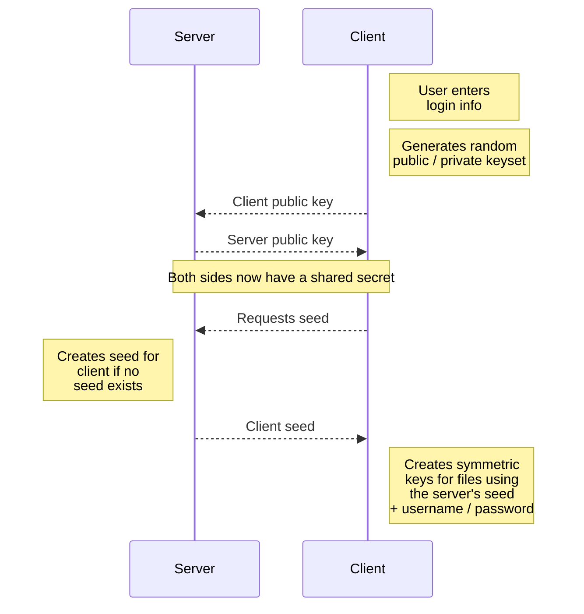

## Login

```mermaid
sequenceDiagram
    participant Server
    participant Client

    note right of Client: User enters<br>login info
    note right of Client: Generates random<br>public / private keyset
    Client-->>Server: Client public key
    Server-->>Client: Server public key
    note over Server, Client: Both sides now have a shared secret


    Client-->>Server: Requests seed
    note left of Server: Creates seed for<br>client if no<br>seed exists
    Server-->>Client: Client seed

    note right of Client: Creates symmetric<br>keys for files using<br>the server's seed<br>+ username / password
```