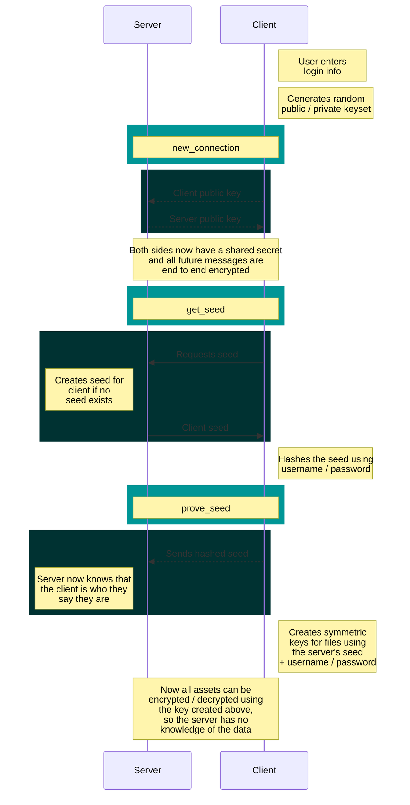

## Login

```mermaid

sequenceDiagram
    participant Server
    participant Client

    note right of Client: User enters<br>login info
    note right of Client: Generates random<br>public / private keyset

    rect rgb(0,150,150)
    note over Server, Client: new_connection
    end
    rect rgb(0,50,50)
    Client-->>Server: Client public key
    Server-->>Client: Server public key
    end

    note over Server, Client: Both sides now have a shared secret<br>and all future messages are<br>end to end encrypted

    rect rgb(0,150,150)
    note over Server, Client: get_seed
    end
    rect rgb(0,50,50)
    Client->>Server: Requests seed
    note left of Server: Creates seed for<br>client if no<br>seed exists
    Server->>Client: Client seed
    end

    note right of Client: Hashes the seed using<br>username / password

    rect rgb(0,150,150)
    note over Server, Client: prove_seed
    end
    rect rgb(0,50,50)
    Client-->>Server: Sends hashed seed
    note left of Server: Server now knows that<br>the client is who they<br>say they are
    end

    note right of Client: Creates symmetric<br>keys for files using<br>the server's seed<br>+ username / password

    note over Server, Client: Now all assets can be<br>encrypted / decrypted using<br>the key created above,<br>so the server has no<br>knowledge of the data
```