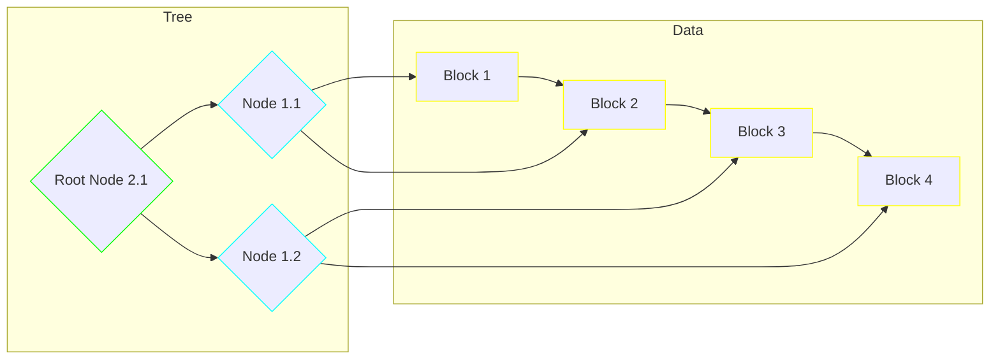

```mermaid
flowchart LR
    classDef fake stroke:#0000

    classDef head stroke:#f00
    classDef block stroke:#ff0
    classDef root stroke:#0f0
    classDef node stroke:#0ff

    classDef head_highlighted stroke:#f66
    classDef block_highlighted stroke:#ff6
    classDef root_highlighted stroke:#6f6
    classDef node_highlighted stroke:#6ff

    subgraph Data
    direction BT
    block1[Block 1]:::block
    %% support1[ ]:::fake
    block2[Block 2]:::block
    %% support2[ ]:::fake
    block3[Block 3]:::block
    %% support3[ ]:::fake
    block4[Block 4]:::block
    %% support4[ ]:::fake
    end

    subgraph Tree
    direction BT
    node1.1{Node 1.1}:::node
    node1.2{Node 1.2}:::node
    node2.1{Root Node 2.1}:::root
    end

    block1 --> block2
    %% support1 ~~~ block1
    %% support1 ~~~ support2
    block2 --> block3
    %% support2 ~~~ block2
    %% support2 ~~~ support3
    block3 --> block4
    %% support3 ~~~ block3
    %% support3 ~~~ support4
    %% support4 ~~~ block4

    node1.1 --> block1
    node1.1 --> block2
    node1.2 --> block3
    node1.2 --> block4
    node2.1 --> node1.1
    node2.1 --> node1.2
```